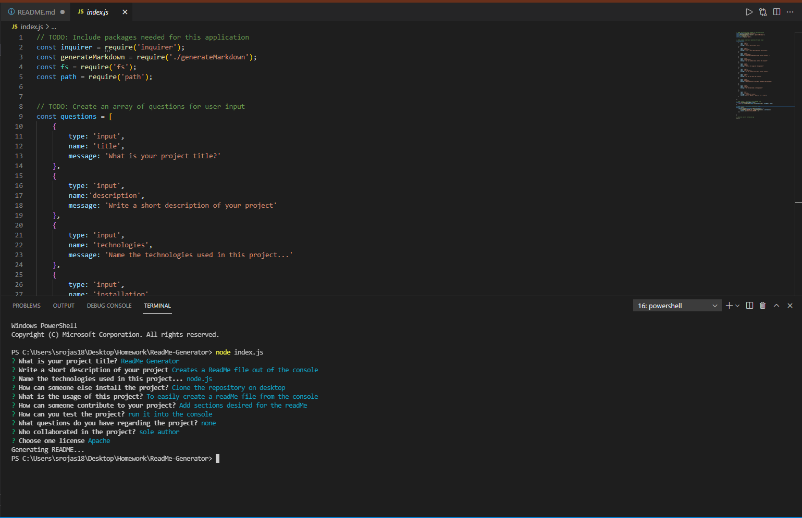
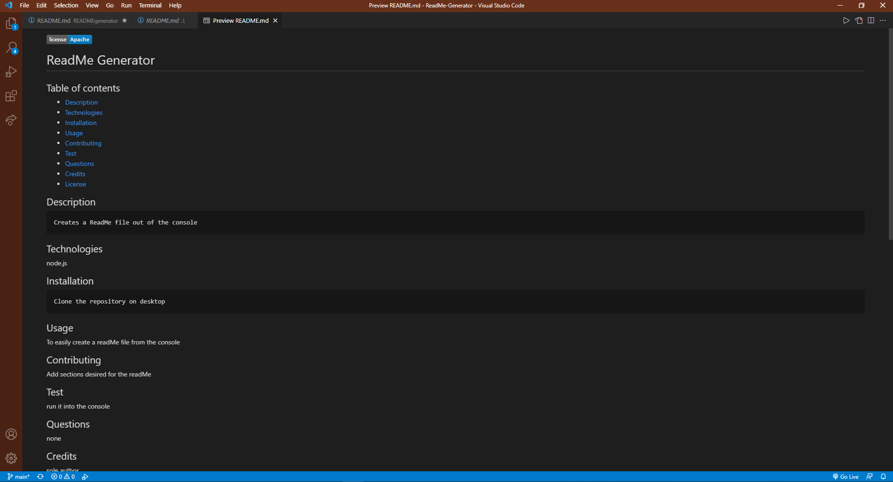
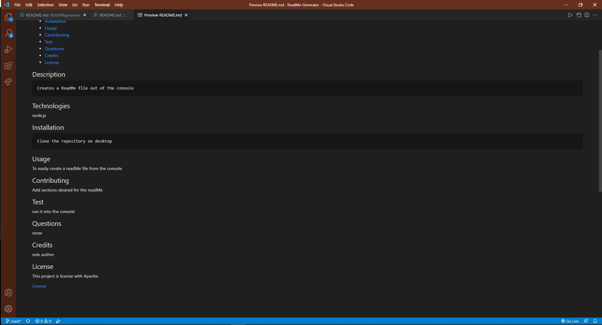

# READMEgenerator

## Table of contents
  * [Description](#Description)
  * [Technologies](#Technologies)
  * [Installation](#Installation)
  * [Usage](#Usage)
  * [Contributing](#Contributing)
  * [Test](#Test)
  * [Questions](#Questions)
  * [Credits](#Credits)
  * [License](#License)

  ## Description
 The following project allows a developer to generates a README.md file for a new project.

  ##  Technologies
  * node.js

  ## Installation
  * Create a repo on GitHub
  * Clone the repo into your desire folder
  * Create an index.js file
  * Create a .gitignore to save the node_modules
  * Open the integrated terminal and install a package json
  * Run npm init, npm install, npm install require, npm install fs
  * Create the functions that would display the readMe file, include all the sections you want the readMe to contain
  * Run into the integrated terminal 
  * Commit the changes

  ## Usage
  It is useful for a developer to have a fast readMe generator that contains all the specifications of a good readMe file must have. 

  ## Test
  Link to the demo: https://drive.google.com/file/d/1gmmPvETbDNhmHYDiGY8G5Ohk1AxrZ5g6/view
  
  
   

  ## Questions
  For further questions please contact the author

  ## Credits
  Sofia Rojas sofiacrf@github.com

  ## Link to github repo
https://sofiacrf.github.io/READMEgenerator/